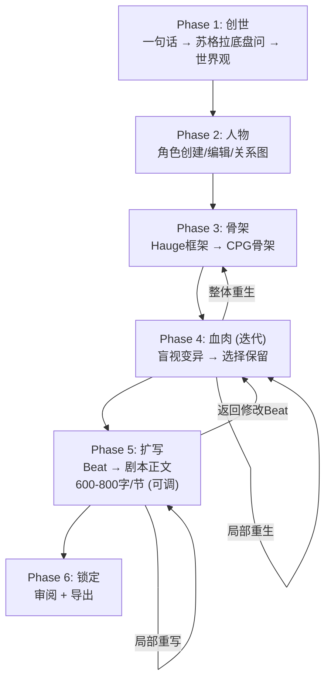

# V2 重大改进计划 — 从"故事生成小工具"升级为"剧本创作系统"

> **核心问题**：当前系统只完成了论文中的"CPG骨架 + Beat填充"，缺少**人物系统**、**剧本格式扩写**、**场景细粒度拆分**三大关键环节。
> 30-40分钟跑完8个节点效率太低，输出的是"故事梗概"而非"剧本"。

---

## 一、问题诊断与对策总表

| # | 问题 | 根因 | 对策 |
|---|------|------|------|
| 1 | 8-9个节点太笼统，不像剧本 | CPG节点 = Hauge大阶段，粒度相当于"章"而非"场景" | 增加**场景拆分层**：每个CPG节点 → 多个具体场景（INT/EXT 场景头） |
| 2 | 输出是"故事"不是"剧本" | 没有"扩写"阶段，Beat只是事件描述 | 新增 **Phase 4: 扩写**，将Beat → 标准剧本格式（场景描述+对话+动作） |
| 3 | 30-40分钟太慢，内容太少 | 每个节点单独跑ITE+RAG（2次额外AI调用），且盲视变异每个人格串行等待3-15秒 | ①ITE/RAG改为**可选一键批量运行** ②缩短间隔为1-5秒 ③扩写阶段支持**批量并行** |
| 4 | 没有人物系统 | 人物角色只在世界观变量中用自然语言描述，没有独立管理 | 新增 **Phase 1.5: 人物设定**，World Lock后独立页面管理角色 |

---

## 二、改进后的完整流程 (6 Phase)



---

## 三、各改进点详细设计

### 3.1 新增 Phase 2: 人物设定 (最重要的新增)

#### 界面设计

```
┌─────────────────────────────────────────────────────────────┐
│  ✅ 创世  ◉ 人物  ○ 骨架  ○ 血肉  ○ 扩写  ○ 锁定         │
│  ━━━━━━━━━━━━━━━━━━━━━━━━━━━━━━━━━━━━━━━━━━━━━━━━━━━━━━━━ │
│                                                             │
│  [左侧 50%] 角色列表                                        │
│  ┌──────────────────────────────────────────────────────┐  │
│  │ [+ 添加角色]  [🤖 AI自动生成角色]  [- 删除选中]      │  │
│  │ ────────────────────────────────────────────────────  │  │
│  │ 📌 主角: 李明（高亮选中）                              │  │
│  │ 📌 反派: 皇帝                                         │  │
│  │ 📌 辅助: 母亲旧部·张将军                               │  │
│  │ 📌 辅助: 青梅竹马·小月                                 │  │
│  │ 📌 配角: 宦官总管                                      │  │
│  └──────────────────────────────────────────────────────┘  │
│                                                             │
│  [右侧 50%] 选中角色详情编辑                                │
│  ┌──────────────────────────────────────────────────────┐  │
│  │ 姓名:     [李明________________]                      │  │
│  │ 角色类型: [主角 ▼] (主角/反派/辅助/配角/群演)          │  │
│  │ 性别:     [男 ▼]                                      │  │
│  │ 年龄:     [25__]                                      │  │
│  │ 职位/身份: [流亡皇子____________]                      │  │
│  │           提示：如"宫廷侍卫长"、"前朝公主"等          │  │
│  │ 性格特征: [机敏、隐忍、内心矛盾__]                     │  │
│  │           提示：2-5个关键词，用顿号分隔                │  │
│  │ 核心动机: [推翻父亲的暴政，为母亲复仇_____]            │  │
│  │           提示：这个角色最想达成什么？                   │  │
│  │ 外貌简述: [清瘦少年，左手有烧伤疤痕____]               │  │
│  │           提示：关键外貌特征，用于场景描写              │  │
│  │ 备注:     [多行文本框，任意自然语言补充]                │  │
│  └──────────────────────────────────────────────────────┘  │
│                                                             │
│  [下方] 人物关系                                             │
│  ┌──────────────────────────────────────────────────────┐  │
│  │ [+ 添加关系]                                          │  │
│  │ 李明 --[父子/敌对]--> 皇帝                             │  │
│  │ 李明 --[母子/信仰]--> 母亲(已故)                       │  │
│  │ 李明 --[主从/信任]--> 张将军                            │  │
│  │ 李明 --[青梅竹马/暧昧]--> 小月                          │  │
│  └──────────────────────────────────────────────────────┘  │
│                                                             │
│  [← 返回创世]               [确认人物设定，进入骨架 →]       │
└─────────────────────────────────────────────────────────────┘
```

#### 数据结构

```python
# 新增到 models/data_models.py
@dataclass
class Character:
    char_id: str              # "char_001"
    name: str                 # "李明"
    role_type: str            # 主角|反派|辅助|配角|群演
    gender: str               # 男|女|其他
    age: str                  # "25" 或 "中年"
    position: str             # 职位/身份
    personality: str          # 性格特征
    motivation: str           # 核心动机
    appearance: str           # 外貌简述
    notes: str = ""           # 备注

@dataclass
class CharacterRelation:
    from_char: str            # char_id
    to_char: str              # char_id
    relation_type: str        # "父子/敌对"
    description: str = ""     # 关系补充说明
```

#### AI 生成支持

> 新增 **AI-Call-1.5: 角色自动生成**  
> 输入: 一句话梗概 + 世界观变量  
> 输出: 3-8个建议角色 + 关键关系  
> Temperature: 0.5  
> 用户可选择性采纳，也可全手动

#### 对后续阶段的影响

- **CPG骨架生成(AI-Call-3)**: User Prompt增加 `{characters_json}` — 完整角色列表
- **盲视变异(AI-Call-4)**: User Prompt增加角色信息，强制输出中使用角色实名
- **扩写阶段**: 对话必须使用角色真实姓名，性格驱动语言风格
- **RAG审查(AI-Call-6)**: 增加"角色行为一致性"检查维度

---

### 3.2 新增 Phase 5: 剧本扩写 (论文中的 Hierarchical Expansion)

> 来源：论文总结1第6点 "叙述扩张"、总结2第5阶段 "剧本层次化扩写"

#### 扩写策略

每个已确认的CPG节点（Beat），独立扩写为**标准短剧剧本格式**：

```
场景 3  【INT. 皇宫密室 - 夜晚】

（苍白的月光透过窗棂，照在满是灰尘的密室地板上。李明蹲在角落，手指
颤抖地拆开一只铜制匣子的封蜡。）

李明（低声）：母亲……你到底给我留下了什么……

（匣子打开，一束微弱的蓝光从内部射出。里面是一枚晶莹的芯片装置，
表面刻有现代科技才能实现的电路纹路。）

张将军（从暗处走出，单膝跪地）：殿下，这就是夫人用生命守护的东西。
    
...（标准剧本格式，600-800字）
```

#### 新增 AI-Call-7: 剧本扩写

```python
SYSTEM_PROMPT_EXPANSION = """你是一位资深短剧编剧。

## 你的任务
将一个结构化的 Story Beat（故事节拍）扩写为标准的短剧剧本片段。

## 输出格式要求
严格使用以下剧本格式：
- 场景头: 【场景类型. 地点 - 时间】（如：【INT. 皇宫密室 - 夜晚】）
- 动作描写: 用圆括号包裹，描写场景环境和角色动作
- 对话: 角色名（语气/状态说明）：对话内容
- 每个场景片段 {target_word_count} 字左右

## 创作原则
1. 对话必须使用角色真实姓名，禁止用"主角""反派"等代称
2. 对话要反映角色性格：{character_personality_hints}
3. 场景描写使用画面感强的动词和形容词
4. 确保因果衔接：每个场景的开头要承接上一场景的"hook"
5. 保留悬念钩子在场景结尾

## 输出
直接输出剧本正文（纯文本，不要JSON格式），外加一个分隔线后输出简短的导演提示。
"""
```

#### 界面设计

```
┌─────────────────────────────────────────────────────────────┐
│  ✅ 创世  ✅ 人物  ✅ 骨架  ✅ 血肉  ◉ 扩写  ○ 锁定         │
│  ━━━━━━━━━━━━━━━━━━━━━━━━━━━━━━━━━━━━━━━━━━━━━━━━━━━━━━━━ │
│                                                             │
│  目标字数: [600-800字/节 ▼]  当前节点: [N3: 秘密揭露 ▼]      │
│  进度: ✅N1 ✅N2 ◉N3 ⬜N4 ⬜N5 ⬜N6 ⬜N7                    │
│  ─────────────────────────────────────────────────────────  │
│                                                             │
│  [左侧 40%] Beat 摘要（只读参考）    │ [右侧 60%] 剧本编辑   │
│  ┌────────────────────────┐         │ ┌────────────────────┐│
│  │ 场景: 皇宫密室，夜晚    │         │ │ 场景 3             ││
│  │ 角色: 李明、张将军       │         │ │ 【INT. 皇宫密室    ││
│  │ 事件1: 发现密函         │         │ │   - 夜晚】         ││
│  │ 事件2: 真相揭示         │         │ │                    ││
│  │ 事件3: 旧部现身         │         │ │ （苍白的月光透过窗   ││
│  │ Hook: 芯片暗含坐标      │         │ │  棂...）            ││
│  │                        │         │ │                    ││
│  │ 角色性格参考:           │         │ │ 李明（低声）：       ││
│  │ • 李明: 机敏、隐忍      │         │ │ 母亲……            ││
│  │ • 张将军: 忠厚、老练    │         │ │                    ││
│  └────────────────────────┘         │ │ [可编辑，实时同步]  ││
│                                      │ └────────────────────┘│
│  ─────────────────────────────────────────────────────────  │
│  字数统计: 732字  │  状态: ✅ 符合目标范围                    │
│                                                             │
│  [🤖 AI扩写当前节点] [🤖 批量扩写全部] [重新扩写]             │
│  [← 返回血肉修改Beat]                  [完成扩写 → 锁定]     │
└─────────────────────────────────────────────────────────────┘
```

#### 关键特性
- **目标字数用户可调**: 默认600-800字/节，可设置为 300-500（短）或 800-1200（详细）
- **批量扩写**: 一键对所有已确认Beat执行扩写，无需逐个等待
- **实时可编辑**: 扩写结果直接在富文本编辑器中显示，用户可随时修改
- **字数统计**: 实时显示当前字数，颜色提示是否在目标范围内

---

### 3.3 优化 Phase 4 (原Blood): 效率提升

#### 问题：30-40分钟太慢

**当前流程（每节点）：**
1. 选择人格 → 生成变体（每人格3-15秒间隔 × N个人格）~= 30-150秒
2. 用户选择 + 编辑
3. ITE分析（AI调用1次）~= 10-15秒
4. RAG审查（AI调用1次）~= 10-15秒
5. 共 ~= **50-180秒/节点** + 用户操作时间

**优化方案：**

| 优化项 | 当前 | 改进后 |
|-------|------|--------|
| 调用间隔 | 3-15秒随机 | **1-5秒随机**（Flash模型QPS足够） |
| ITE分析 | 每确认一个Beat立即分析 | **改为可选按钮**，不默认执行 |
| RAG审查 | 每确认一个Beat立即审查 | **改为可选按钮**，不默认执行 |
| ITE+RAG触发 | 逐节点触发 | 增加**批量一键运行**（全部确认后统一分析） |
| 确认后跳转 | 先看ITE/RAG结果，再选下一步 | 确认后**直接跳到下一节点**，ITE/RAG结果放侧边通知 |

> [!IMPORTANT]
> 将 `proxyserverconfig.py` 中的 `MIN_CALL_INTERVAL` 从 3 改为 1，`MAX_CALL_INTERVAL` 从 15 改为 5。
> ITE/RAG从"强制流程"变为"可选工具"——这大幅缩短主流程时间。

---

### 3.4 CPG节点粒度问题

**当前**: Hauge 6阶段，每阶段1-3节点，共6-15个节点。每节点 = 1个场景。
**问题**: 这些节点更像"章节"概梗，而非具体场景。

**改进方案**: **不改变CPG本身的粒度**。

> [!TIP]
> CPG节点仍然保持"逻辑骨架"级别——这是论文的设计意图。
> 在**扩写阶段(Phase 5)** 自动将每个CPG节点拆分为1-3个具体场景。
> 这样CPG保持简洁可编辑，场景在扩写时自动细化。

---

## 四、要修改/新增的文件清单

### 新增文件

| 文件 | 说明 |
|------|------|
| `ui/phase2_characters.py` | **[NEW]** Phase 2: 人物设定界面 |
| `ui/phase5_expansion.py` | **[NEW]** Phase 5: 剧本扩写界面 |
| `ui/widgets/character_editor.py` | **[NEW]** 角色编辑器组件 |
| `ui/widgets/character_relation_panel.py` | **[NEW]** 人物关系管理组件 |
| `ui/widgets/screenplay_editor.py` | **[NEW]** 剧本文本编辑器（带字数统计） |

### 修改文件

| 文件 | 修改内容 |
|------|---------|
| `env.py` | 新增 AI-Call-1.5(角色生成) + AI-Call-7(剧本扩写) 的Prompt |
| `models/data_models.py` | 新增 `Character` + `CharacterRelation` dataclass |
| `models/project_state.py` | 新增 `characters` + `relations` + `screenplay_texts` 字段 |
| `services/worker.py` | 新增 `CharacterGenWorker` + `ExpansionWorker` |
| `ui/main_window.py` | 导航栏从4阶段改为6阶段，插入Phase 2(人物)和Phase 5(扩写) |
| `ui/phase2_skeleton.py` | 重命名为Phase 3，Prompt增加角色信息 |
| `ui/phase3_flesh.py` | 重命名为Phase 4，ITE/RAG改为可选，优化流程 |
| `ui/phase4_lock.py` | 重命名为Phase 6，增加剧本文本预览 |
| `proxyserverconfig.py` | 调用间隔改为 1-5秒 |

---

## 五、实施顺序

| 顺序 | 任务 | 预计工作量 |
|------|------|-----------|
| **1** | 数据模型扩展 (`Character`, `CharacterRelation`, `screenplay_texts`) | 小 |
| **2** | `env.py` 新增2个Prompt (AI-Call-1.5 + AI-Call-7) | 小 |
| **3** | 新建 Phase 2 人物设定界面 + 编辑器 widget | 大 |
| **4** | Phase 4 (原Blood)效率优化: ITE/RAG改可选，间隔缩短 | 中 |
| **5** | 新建 Phase 5 扩写界面 + 剧本编辑器 widget | 大 |
| **6** | 主窗口导航改为6阶段，重新连接信号 | 中 |
| **7** | 全部AI调用Prompt注入角色信息 | 中 |
| **8** | 联调测试 | 中 |

---

## 六、开放问题 (需要您决定)

> [!IMPORTANT]
> ### Q1: AI自动生成角色 vs 纯手动
> 是否需要 AI-Call-1.5 自动根据梗概 + 世界观生成建议角色？还是全部手动创建？
> 建议：**两者都支持** — 提供"AI建议"按钮 + 手动添加。

> [!IMPORTANT]
> ### Q2: 扩写阶段的场景拆分
> 一个CPG节点扩写时，是AI自动决定拆成几个场景？还是用户指定"本节拆N个场景"？
> 建议：**AI自动拆** + 用户可在扩写后手动拆分/合并。

> [!IMPORTANT]
> ### Q3: 剧本导出格式
> 最终导出除了 `.story.json`（工程文件），剧本正文需要导出成什么格式？
> - 纯文本 `.txt`
> - Word `.docx`
> - PDF
> - 专业编剧格式（Fountain格式 `.fountain`）
> 建议：先做 `.txt` 导出，后续可扩展。

---

## 七、验证计划

### 自动验证
- `Character` / `CharacterRelation` 的序列化往返测试
- 角色信息正确注入到 AI-Call-3/4/7 的 Prompt 中
- 扩写文本字数验证（600-800字范围检测）

### 手动验证
1. 创建3-5个角色 + 关系 → 骨架生成中能引用角色名
2. Blood阶段确认Beat后，不强制等ITE/RAG，直接下一节点
3. 扩写阶段: 剧本正文使用真实角色名 + 有对话 + 有场景头
4. 全流程时间从30-40分钟缩短到15分钟以内（预期）
