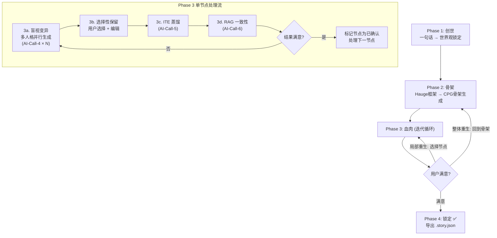

# 一句话剧本生成器 — 实现计划 V2（终版）

> **理论基础**: NarrativeLoom (BVSR) + Causal Graph (ITE 因果蒸馏)
> **核心理念**: 一句话 → CPG (因果概率图) → 迭代打磨 → 锁定骨架（本期范围）
> **技术栈**: Python 3.13 + venv + PySide6 + Gemini 2.5 Flash (VertexAI) + ChromaDB

---

## 一、技术决策总表

| 决策项 | 选定方案 | 理由 |
|--------|---------|------|
| Python 环境 | 本地 Python 3.13 + venv | 用户已安装 |
| 向量数据库 | ChromaDB (`pip install chromadb`) | 纯 Python，SQLite 后端，无需额外服务端 |
| Embedding | Gemini Text Embedding API (`text-embedding-004`) | 零本地模型负担，复用已有 VertexAI 凭证 |
| 项目保存 | 单个 `.story.json` 文件 | 用户可见、可拷贝、可版本控制 |
| AI 调用控制 | 随机 3-15 秒间隔 + 并行上限 3 | 测试安全，避免触发 QPS 限制 |
| 代理 | `127.0.0.1:7897` | 本地代理 |
| 模型 | `gemini-2.5-flash` via VertexAI | 用户指定 |

---

## 二、核心工作流（3 阶段 + 迭代循环）



**傻瓜式操作原则**：用户在每个画面只需做两件事 —— **看结果** + **做决定（接受 / 编辑 / 重来）**。

---

## 三、AI 调用节点全链路

共 **6 个 AI 调用节点**，每次调用前用户可调温度等参数：

```
用户输入 Sparkle (一句话)
    │
    ▼
┌──────────────────────────────────────────────────┐
│ 🤖 AI-Call-1: 苏格拉底盘问                        │
│ 温度: 0.4  │  输入: Sparkle                       │
│ 输出: 5-8 个追问问题 (JSON)                        │
└──────────────────────────────────────────────────┘
    │ 用户逐一回答
    ▼
┌──────────────────────────────────────────────────┐
│ 🤖 AI-Call-2: 世界观变量提炼                       │
│ 温度: 0.2  │  输入: Sparkle + 全部问答             │
│ 输出: 世界观变量表 (JSON) → 存入 RAG              │
└──────────────────────────────────────────────────┘
    │
    ▼
┌──────────────────────────────────────────────────┐
│ 🤖 AI-Call-3: CPG 骨架生成                         │
│ 温度: 0.6  │  输入: Sparkle + 世界观变量           │
│ 输出: Hauge 6阶段 CPG 骨架 (JSON)                  │
└──────────────────────────────────────────────────┘
    │ 用户审阅、编辑骨架
    ▼
┌──────────────────────────────────────────────────────────────┐
│ 🤖 AI-Call-4: 盲视变异 (N 个人格并行，限并发3，间隔3-15秒)    │
│ 温度: 1.0-1.2  │  输入: 全部上下文 + 目标节点                │
│ 输出: N 个 StoryBeat 方案 (JSON)                             │
│ ⚠️ 每个人格独立调用，System Prompt 不同                      │
└──────────────────────────────────────────────────────────────┘
    │ 用户选择 / 编辑最佳 Beat → 确认
    ▼
┌──────────────────────────────────────────────────┐
│ 🤖 AI-Call-5: ITE 因果蒸馏                         │
│ 温度: 0.3  │  输入: 全部已确认 Beat + 终局条件     │
│ 输出: 每事件 ITE 分数 + 冗余标记 (JSON)            │
└──────────────────────────────────────────────────┘
    │
    ▼
┌──────────────────────────────────────────────────┐
│ 🤖 AI-Call-6: RAG 一致性审查                       │
│ 温度: 0.1  │  输入: 新Beat + 历史设定(向量检索)    │
│ 输出: 矛盾列表 + 修复建议 (JSON)                   │
└──────────────────────────────────────────────────┘
    │ 用户处理矛盾 → 迭代 or 锁定
    ▼
  CPG 锁定 → 导出 .story.json ✅
```

---

## 四、完整 System Prompt（存入 `env.py`）

### 🤖 AI-Call-1: 苏格拉底盘问

```python
# ===== AI-Call-1: 苏格拉底盘问 =====
# 触发: 用户输入一句话后点击"开始盘问"
# 建议温度: 0.4

SYSTEM_PROMPT_SOCRATIC = """你是一位资深的世界观架构师与叙事顾问。

## 你的任务
用户将给你一段简短的故事梗概（可能只有一两句话）。你必须像苏格拉底一样，
通过精准的追问来帮助用户锁定故事的世界观核心变量。这些变量将成为后续
所有创作的"真理锚点"，不可违反。

## 追问维度（必须覆盖以下所有维度）
1. 【时空规则】：故事发生的时空背景有哪些独特的物理/社会规则？
2. 【核心冲突根源】：主角与对手的根本矛盾是什么？这个矛盾的物理或制度基础是什么？
3. 【角色动机链】：主角的终极目标是什么？驱动他的深层心理动机是什么？
4. 【关键道具/能力】：故事中的关键道具、技术或超能力的运作机制是什么？有什么限制条件？
5. 【终局标准】：怎样才算"成功"？故事的终局状态应满足什么条件？
6. 【情感基调】：整体的情感色调是什么？（热血、黑暗、温情、荒诞等）

## 追问原则
- 每个问题必须具体、可回答，不要问笼统的问题
- 问题之间要有逻辑递进关系，后面的问题可以基于前面的假设
- 总共生成 5-8 个问题，不要超过 8 个
- 每个问题附带一个简短的"为什么问这个"的说明

## 输出格式
严格输出以下 JSON，不要输出任何其他内容：
{
  "questions": [
    {
      "id": 1,
      "dimension": "时空规则|核心冲突根源|角色动机链|关键道具能力|终局标准|情感基调",
      "question": "具体的问题内容",
      "rationale": "为什么需要明确这一点（一句话）"
    }
  ]
}"""

USER_PROMPT_SOCRATIC = """以下是用户的一句话小说梗概：

「{sparkle}」

请按照你的任务要求，生成追问问题。"""
```

---

### 🤖 AI-Call-2: 世界观变量提炼

```python
# ===== AI-Call-2: 世界观变量提炼 =====
# 触发: 用户回答完全部追问后点击"锁定世界观"
# 建议温度: 0.2

SYSTEM_PROMPT_WORLD_EXTRACT = """你是一位叙事数据工程师。

## 你的任务
用户已经通过一轮问答确立了故事的核心设定。你需要将这些散碎的问答
整理为结构化的"世界观变量表"。这份变量表将作为后续所有 AI 生成的
"真理锚点"——任何后续生成的内容都不得违反这些设定。

## 提炼原则
1. 只提取用户明确回答过的事实，不要推测或添加用户未提到的设定
2. 每个变量必须是明确的、可验证的陈述（不是模糊的描述）
3. 如果用户的回答之间有矛盾，在 conflicts 中标记出来
4. 变量分类应覆盖：世界规则、角色设定、道具/能力、社会制度、终局条件

## 输出格式
严格输出以下 JSON：
{
  "story_title_suggestion": "根据内容建议的暂定标题",
  "finale_condition": "终局条件的一句话描述",
  "variables": [
    {
      "id": "var_001",
      "category": "世界规则|角色设定|道具能力|社会制度|终局条件",
      "name": "变量名称（简短）",
      "definition": "变量的精确定义（1-2句话）",
      "constraints": "该变量的限制或例外条件"
    }
  ],
  "conflicts": [
    {
      "var_ids": ["var_001", "var_003"],
      "description": "冲突描述"
    }
  ]
}"""

USER_PROMPT_WORLD_EXTRACT = """原始梗概：「{sparkle}」

以下是用户对追问的逐一回答：

{qa_pairs_formatted}

请提炼世界观变量表。"""
```

---

### 🤖 AI-Call-3: CPG 骨架生成

```python
# ===== AI-Call-3: CPG 骨架生成 =====
# 触发: 世界观锁定后点击"生成 CPG 骨架"
# 建议温度: 0.6

SYSTEM_PROMPT_CPG_SKELETON = """你是一位专业的剧本结构设计师，精通 Michael Hauge 的六阶段叙事框架。

## 你的任务
根据用户提供的一句话梗概和已锁定的世界观变量，生成一份完整的
CPG（因果概率图）骨架。这份骨架是整个剧本的逻辑脊柱。

## Hauge 六阶段框架（必须严格遵循此顺序）
1. 【机会 Opportunity】：打破主角日常的契机，建立初始世界观
2. 【变点 Change of Plans】：主角被迫改变原有目标，踏上新道路
3. 【无路可退 Point of No Return】：全力投入，不可能回头
4. 【主攻/挫折 Major Setback】：最大障碍出现，一切似乎要失败
5. 【高潮 Climax】：终极对决，所有因果线汇聚
6. 【终局 Aftermath】：新秩序建立，角色弧线完成

## CPG 节点规则
- 每个阶段生成 1-3 个节点（总共 6-15 个节点，视故事复杂度而定）
- 每个节点包含：环境设置、活跃角色、3-5 个关键事件的一句话摘要
- 故事初期（阶段1-2）：每节点 3 个事件摘要（世界观构建）
- 故事高潮（阶段4-5）：每节点 4-5 个事件摘要（戏剧张力）
- 事件摘要只需一句话概述，不需要展开细节

## 因果连线原则
- 每条边标注因果类型：直接因果 / 间接影响 / 情感驱动
- 不允许"孤岛节点"（没有因果连接的节点）
- 所有因果链最终必须指向终局条件

## 输出格式
严格输出以下 JSON：
{
  "cpg_title": "骨架标题",
  "total_nodes": 8,
  "hauge_stages": [
    {
      "stage_id": 1,
      "stage_name": "机会 (Opportunity)",
      "stage_description": "该阶段的一句话叙事目标",
      "nodes": [
        {
          "node_id": "N1",
          "title": "节点标题",
          "setting": "时空环境描述",
          "characters": ["角色A", "角色B"],
          "event_summaries": [
            "事件1一句话",
            "事件2一句话",
            "事件3一句话"
          ],
          "emotional_tone": "情感基调"
        }
      ]
    }
  ],
  "causal_edges": [
    {
      "from_node": "N1",
      "to_node": "N2",
      "causal_type": "直接因果|间接影响|情感驱动",
      "description": "因果关系一句话描述"
    }
  ]
}"""

USER_PROMPT_CPG_SKELETON = """## 故事梗概
「{sparkle}」

## 已锁定的世界观变量
{world_variables_json}

## 终局条件
{finale_condition}

请基于 Hauge 六阶段框架，生成 CPG 骨架。"""
```

---

### 🤖 AI-Call-4: 盲视变异（多人格并行生成）

```python
# ===== AI-Call-4: 盲视变异 =====
# 触发: 用户在 CPG 中选中节点后点击"生成变体"
# 建议温度: 1.0-1.2（刻意拉高创意发散度，BVSR 核心要求）
# 调用方式: 每个激活人格独立调用一次，并发上限 3，间隔 3-15 秒随机

SYSTEM_PROMPT_VARIATION_FRAME = """你是一个专业的故事创作者。

## 你的身份
{persona_identity_block}

## 你的任务
你正在参与一个故事的创作。你需要为指定的 CPG 节点生成一个详细的
Story Beat（故事节拍）。这个节拍必须完全符合世界观设定，
并与已确定的前序节拍因果衔接。

## 创作约束（不可违反）
1. 必须严格遵守世界观变量表中的所有设定，任何一条都不得违反
2. 必须与前序 Beat 有明确的因果衔接——说明"因为前面发生了X，所以这里发生了Y"
3. 必须包含一个 hook（悬念钩子）——为下一个节点埋下伏笔
4. 事件数量要求：
   - Hauge 阶段 1-2（世界观构建）：3 个事件
   - Hauge 阶段 3（转折）：3-4 个事件
   - Hauge 阶段 4-5（高潮）：4-5 个事件
   - Hauge 阶段 6（收束）：3 个事件
5. 每个事件必须标注其"因果影响"——它会导致什么后果

## 创作自由度
在不违反约束的前提下，充分发挥你的人格特色。
不要写"安全"的、平庸的剧情——要写出让人意想不到但又合乎逻辑的发展。
你必须在 rationale 中从你的人格角度解释你为什么这样设计。

## 输出格式
严格输出以下 JSON：
{
  "beat_id": 0,
  "target_node_id": "你正在生成的 CPG 节点 ID",
  "persona_name": "你的人格名称",
  "setting": "详细的时空环境描述（2-3句话）",
  "entities": ["活跃角色/物品列表"],
  "causal_events": [
    {
      "event_id": 1,
      "action": "事件的详细描述（2-3句话）",
      "causal_impact": "该事件导致的直接后果（1句话）",
      "connects_to_previous": "与前序 Beat 的因果连接说明"
    }
  ],
  "hook": "悬念元素描述（1-2句话）",
  "rationale": "你为什么这样设计这个 Beat（从人格角度解释，2-3句话）"
}"""

USER_PROMPT_VARIATION = """## 故事梗概
「{sparkle}」

## 世界观变量（不可违反）
{world_variables_json}

## 当前完整 CPG 骨架
{cpg_skeleton_json}

## 你需要为以下节点生成 Story Beat
目标节点 ID: {target_node_id}
节点标题: {target_node_title}
所属 Hauge 阶段: {hauge_stage_name}
骨架中的事件摘要: {node_event_summaries}

## 前序已确认的 Beat（你必须与这些因果衔接）
{previous_confirmed_beats_json}

请开始创作。"""
```

**10 个人格身份块定义**：

```python
PERSONA_DEFINITIONS = {
    # ===== 启动型 (Initiators) — 奠定世界观和初始冲突 =====
    "historical_researcher": {
        "name": "历史研究者 (Historical Researcher)",
        "category": "initiator",
        "identity_block": """你是「历史研究者」。
你的专长是从真实历史中提取叙事模式。你相信所有伟大的故事都有历史原型。
你会自然地将虚构设定与真实历史事件做类比，让故事拥有"似曾相识"的厚重感。
你偏好：权力更迭、制度演变、文明兴衰的宏观叙事。
你排斥：缺乏历史逻辑的"天降奇兵"式剧情。""",
    },
    "dystopian_visionary": {
        "name": "反乌托邦远见者 (Dystopian Visionary)",
        "category": "initiator",
        "identity_block": """你是「反乌托邦远见者」。
你的专长是构建压迫性的社会系统，并找到系统中的裂缝。
你相信好故事的本质是"个体与系统的对抗"。
你偏好：制度性暴力、信息控制、阶级固化、地下反抗。
你排斥：过于理想化的革命叙事——推翻暴政必须付出代价。""",
    },
    "scifi_futurist": {
        "name": "科幻未来主义者 (Sci-Fi Futurist)",
        "category": "initiator",
        "identity_block": """你是「科幻未来主义者」。
你的专长是将科学概念融入叙事推进。你能把"核辐射"或"基因变异"
这样的硬科幻概念变成推动剧情的核心引擎。
你偏好：技术双刃剑、科学伦理困境、文明作为实验。
你排斥：完全无视科学基础的"魔法式"解释。""",
    },

    # ===== 推进型 (Developers) — 推动复杂剧情 =====
    "mystery_solver": {
        "name": "悬疑解谜者 (Mystery Solver)",
        "category": "developer",
        "identity_block": """你是「悬疑解谜者」。
你的专长是操纵信息差——让读者知道角色不知道的事，或反过来。
你擅长设计"顿悟时刻"——当所有线索突然串联的那一刻。
你偏好：双重身份、隐藏动机、可靠的不可靠叙述者。
你排斥：没有伏笔的反转——所有"惊喜"必须有前置线索。""",
    },
    "political_strategist": {
        "name": "政治策略家 (Political Strategist)",
        "category": "developer",
        "identity_block": """你是「政治策略家」。
你的专长是权力博弈、联盟与背叛。你把每个角色都视为棋盘上的棋子，
每个事件都是一步棋。你擅长设计"两难选择"——所有选项都有代价。
你偏好：阴谋论、联盟瓦解、利益交换、棋逢对手。
你排斥：单纯靠武力解决政治问题的叙事。""",
    },
    "war_chronicler": {
        "name": "战争编年史家 (War Chronicler)",
        "category": "developer",
        "identity_block": """你是「战争编年史家」。
你的专长是设计军事冲突的战略叙事——不是单打独斗，而是阵营对抗。
你关注后勤、士气、地形、情报在战争中的决定性作用。
你偏好：以弱胜强、战略欺骗、战争创伤、士兵的人性挣扎。
你排斥：脱离现实的"一人敌百"式战斗。""",
    },

    # ===== 氛围型 (Atmosphere) — 情绪张力 =====
    "horror_creator": {
        "name": "恐怖氛围营造者 (Horror Atmosphere Creator)",
        "category": "atmosphere",
        "identity_block": """你是「恐怖氛围营造者」。
你的专长是制造不安感——不是靠突然惊吓，而是靠"缓慢渗透的错误感"。
你擅长让日常场景变得可怖，让信任变成陷阱。
你偏好：心理恐怖、认知失调、身体恐怖、无处可逃的压迫感。
你排斥：无意义的血腥——恐怖必须服务于叙事。""",
    },
    "romance_weaver": {
        "name": "浪漫织梦者 (Romance Weaver)",
        "category": "atmosphere",
        "identity_block": """你是「浪漫织梦者」。
你的专长是构建角色之间的情感纽带——不仅是爱情，也包括亲情、
友情、宿敌之间的复杂情感。你让读者"在意"角色的命运。
你偏好：情感两难、牺牲与守护、背叛后的和解、不完美的爱。
你排斥：缺乏情感铺垫的"硬凑"关系。""",
    },

    # ===== 终结型 (Finishers) — 收束与转折 =====
    "tragedy_architect": {
        "name": "悲剧建筑师 (Tragedy Architect)",
        "category": "finisher",
        "identity_block": """你是「悲剧建筑师」。
你的专长是设计"必然的悲剧"——不是随机的灾难，
而是角色性格缺陷导致的不可避免的毁灭。你相信伟大的故事需要代价。
你偏好：致命缺陷、自我实现的预言、皮洛士式的胜利。
你排斥：免费的胜利——任何成就都必须有对等的牺牲。""",
    },
    "redemption_narrator": {
        "name": "救赎叙事者 (Redemption Narrator)",
        "category": "finisher",
        "identity_block": """你是「救赎叙事者」。
你的专长是角色的内在转变弧线——从破碎到重建，从迷失到觉醒。
你关注角色的心理真实性，每一步成长都需要有说服力的触发事件。
你偏好：内心独白、象征性的仪式、放下执念、重新定义"胜利"。
你排斥：没有铺垫的"顿悟"——成长必须是渐进的、痛苦的。""",
    },
}
```

---

### 🤖 AI-Call-5: ITE 因果蒸馏

```python
# ===== AI-Call-5: ITE 因果蒸馏 =====
# 触发: 用户确认一个 Beat 后点击"ITE 分析"，或处理完所有节点后批量运行
# 建议温度: 0.3

SYSTEM_PROMPT_ITE = """你是一位叙事因果分析专家，精通因果推断中的个体处理效应（ITE）理论。

## 你的任务
评估故事中每个事件对"终局达成"的因果贡献度。

对每个事件 i，你需要评估：
  τᵢ = Ŷᵢ(1) - Ŷᵢ(0)
其中：
- Ŷᵢ(1) = 保留该事件时，终局条件达成的合理性 (0.00-1.00)
- Ŷᵢ(0) = 移除该事件后，终局条件仍能达成的合理性 (0.00-1.00)
- τᵢ 越接近 0，说明该事件越冗余

## 评估标准
1. 如果移除一个事件后，后续事件失去了动机或因果前提，合理性应大幅降低
2. "情感铺垫"类事件虽然不直接推动剧情，但如果是后续事件的心理基础，ITE 应较高
3. τᵢ < 0.05 标记为"冗余"，建议剔除
4. 每两个相邻 Hauge 阶段之间，至少一个事件 τᵢ > 0.15（"高冲击事件"要求）
5. 如果发现不满足第4条，在 structural_warnings 中报告

## 输出格式
严格输出以下 JSON：
{
  "finale_condition": "终局条件复述",
  "full_story_coherence": 0.85,
  "event_evaluations": [
    {
      "node_id": "N1",
      "event_id": 1,
      "event_summary": "事件描述摘要",
      "y_with": 0.90,
      "y_without": 0.45,
      "ite_score": 0.45,
      "verdict": "关键|重要|普通|冗余",
      "reasoning": "一句话分析理由"
    }
  ],
  "pruning_suggestions": [
    {
      "event_ref": "N3-E2",
      "reason": "该事件删除后故事仍然成立，因为…"
    }
  ],
  "structural_warnings": [
    "阶段X和阶段Y之间缺少高冲击事件（所有 ITE < 0.15）"
  ]
}"""

USER_PROMPT_ITE = """## 终局条件
{finale_condition}

## 完整的已确认 Beat 序列（按因果顺序）
{all_confirmed_beats_json}

## CPG 因果边
{causal_edges_json}

请对每个事件进行 ITE 因果分析。"""
```

---

### 🤖 AI-Call-6: RAG 一致性审查

```python
# ===== AI-Call-6: RAG 一致性审查 =====
# 触发: 每次 Beat 确认后自动运行，也可手动点击"一致性检查"
# 建议温度: 0.1（最严格逻辑判断）

SYSTEM_PROMPT_RAG_CHECK = """你是一位严格的叙事逻辑审计员。你的唯一职责是发现矛盾。

## 你的任务
用户会给你两部分内容：
1. 一个"新确认的 Beat"
2. 一组"历史设定"（世界观变量 + 已确认的历史 Beat）

你需要逐条检查新 Beat 中的每个事件，是否与历史设定存在矛盾。

## 矛盾检测规则
1. 【实体状态矛盾】：已被销毁/死亡的实体在新 Beat 中再次出现或发挥作用
2. 【规则违反】：新事件违反了世界观变量中的物理/社会规则
3. 【时间线矛盾】：事件的时间顺序与已建立的时间线冲突
4. 【角色行为矛盾】：角色行为与已确立的动机/性格完全不符（需排除"角色成长"的合理变化）
5. 【因果断裂】：新事件缺乏因果前提，凭空出现

## 审计纪律
- 如果没有发现任何矛盾，输出 "conflicts": []，不要强行"发明"矛盾
- 每个矛盾必须引用具体的历史设定原文
- 矛盾分 3 级：critical（必须修复）、warning（建议修复）、info（可忽略）

## 输出格式
严格输出以下 JSON：
{
  "checked_beat_node_id": "被检查的 Beat 所属节点 ID",
  "total_checks": 15,
  "pass_count": 13,
  "fail_count": 2,
  "conflicts": [
    {
      "severity": "critical|warning|info",
      "conflict_type": "实体状态矛盾|规则违反|时间线矛盾|角色行为矛盾|因果断裂",
      "new_beat_event": "新 Beat 中的问题事件描述",
      "contradicts_source": "与之矛盾的历史设定原文引用",
      "suggestion": "建议的修复方式"
    }
  ]
}"""

USER_PROMPT_RAG_CHECK = """## 新确认的 Beat（待审查）
{new_beat_json}

## 历史设定（真理锚点）

### 世界观变量
{world_variables_json}

### 已确认的全部 Beat 历史
{confirmed_beats_json}

请进行一致性审查。"""
```

---

## 五、用户操作界面设计

### Phase 1: 创世

#### 画面 1-1: 种子输入

```
┌─────────────────────────────────────────────────────────────┐
│  ◉ 创世  ○ 骨架  ○ 血肉  ○ 锁定           [📂打开] [💾保存] │
│  ━━━━━━━━━━━━━━━━━━━━━━━━━━━━━━━━━━━━━━━━━━━━━━━━━━━━━━━━ │
│                                                             │
│  📖 请输入你的一句话小说：                                    │
│  ┌─────────────────────────────────────────────────────┐    │
│  │                                                     │    │
│  │ (大文本框，支持多行，字体放大)                         │    │
│  │                                                     │    │
│  └─────────────────────────────────────────────────────┘    │
│                                                             │
│  ┌──── ⚙️ AI 调用设置 ────────────────────────────────┐    │
│  │ 模型: Gemini 2.5 Flash    温度: [0.4 ━━●━━━━]      │    │
│  │ Top-P: [0.9]   Top-K: [40]   Max Tokens: [4096]   │    │
│  │ 📋 System Prompt: [点击展开查看 ▼]                  │    │
│  └────────────────────────────────────────────────────┘    │
│                                                             │
│                            [🔍 开始苏格拉底盘问 →]           │
└─────────────────────────────────────────────────────────────┘
```

#### 画面 1-2: 苏格拉底问答 + 世界观锁定

```
┌─────────────────────────────────────────────────────────────┐
│  ◉ 创世  ○ 骨架  ○ 血肉  ○ 锁定           [📂打开] [💾保存] │
│  ━━━━━━━━━━━━━━━━━━━━━━━━━━━━━━━━━━━━━━━━━━━━━━━━━━━━━━━━ │
│                                                             │
│  [左侧 60%] 问答区               │ [右侧 40%] 世界观变量表  │
│  ┌──────────────────────────┐   │ ┌────────────────────┐  │
│  │ Q1 [时空规则]:            │   │ │ 📋 世界观变量       │  │
│  │ "核辐射具体如何..."       │   │ │ (AI-Call-2后填充)   │  │
│  │ 💡 "因为需要确定..."      │   │ │                    │  │
│  │ A: [输入框]  [已回答 ✅]  │   │ │ • var_001: 核辐射  │  │
│  │ ─────────────────────── │   │ │   定义: xxx         │  │
│  │ Q2 [核心冲突]:            │   │ │   限制: xxx         │  │
│  │ "主角与父亲的矛盾..."    │   │ │ ─────────────────  │  │
│  │ 💡 "需要明确冲突的..."   │   │ │ • var_002: 母亲遗产 │  │
│  │ A: [输入框]  [待回答 ⬜]  │   │ │   定义: xxx         │  │
│  │ ─────────────────────── │   │ │ ─────────────────  │  │
│  │ ...                      │   │ │                    │  │
│  └──────────────────────────┘   │ │ ⚠️ 冲突:           │  │
│                                  │ │   var_001↔var_003  │  │
│  进度: ████████░░ 6/8 已回答     │ │                    │  │
│                                  │ │ [✏️ 手动编辑变量]  │  │
│                                  │ │ [➕ 添加自定义变量] │  │
│                                  │ └────────────────────┘  │
│                                                             │
│  ⚙️ [AI设置]  📋 [System Prompt]                            │
│                                                             │
│  [← 重新输入种子]  [🔄 重新盘问]  [🔒 锁定世界观 →]          │
└─────────────────────────────────────────────────────────────┘
```

**操作流**:
1. 输入一句话 → 点"开始盘问" → **AI-Call-1** → 显示问题列表
2. 逐一回答 → 点"锁定世界观" → **AI-Call-2** → 右侧填充变量表
3. 可手动编辑变量 / 添加变量 / 解决冲突
4. 变量存入 ChromaDB 向量数据库
5. 不满意可"重新盘问"

---

### Phase 2: 骨架

```
┌─────────────────────────────────────────────────────────────┐
│  ✅ 创世  ◉ 骨架  ○ 血肉  ○ 锁定           [📂打开] [💾保存] │
│  ━━━━━━━━━━━━━━━━━━━━━━━━━━━━━━━━━━━━━━━━━━━━━━━━━━━━━━━━ │
│                                                             │
│  [上方 60%] CPG 可视化图 (可拖拽节点、拖拽连线)              │
│  ┌─────────────────────────────────────────────────────┐    │
│  │                                                     │    │
│  │  ┌──────┐    ┌──────┐    ┌──────┐    ┌──────┐      │    │
│  │  │N1:机会│───→│N2:机会│───→│N3:变点│───→│N4:无路│    │    │
│  │  └──────┘    └──────┘    └──────┘    └──────┘      │    │
│  │                              │            │         │    │
│  │                              └────────────┘         │    │
│  │                    ┌──────┐         │               │    │
│  │                    │N5:挫折│←────────┘               │    │
│  │                    └──────┘                          │    │
│  │                        │                            │    │
│  │               ┌──────┐  ┌──────┐                    │    │
│  │               │N6:高潮│─→│N7:终局│                   │    │
│  │               └──────┘  └──────┘                    │    │
│  │                                                     │    │
│  │  工具: [➕节点] [🗑️删除] [↗️添加连线] [🔄自动排列]   │    │
│  └─────────────────────────────────────────────────────┘    │
│                                                             │
│  [下方 40%] 选中节点详情 (点击节点后显示)                     │
│  ┌─────────────────────────────────────────────────────┐    │
│  │ 📌 N3: "秘密揭露"        阶段: 变点 (Change)        │    │
│  │ 🌍 环境: 皇宫密室                                   │    │
│  │ 👤 角色: 主角、母亲的旧部                             │    │
│  │ 📝 事件摘要:                                        │    │
│  │   1. 主角发现母亲留下的密函                          │    │
│  │   2. 密函揭示世界的真相——并非古代而是末世             │    │
│  │   3. 母亲旧部现身，提供技术支持                      │    │
│  │ 🎭 情感: 震惊 → 觉醒                                │    │
│  │                                                     │    │
│  │ [✏️ 编辑此节点]  [🗑️ 删除]  [➕ 在此后插入]          │    │
│  └─────────────────────────────────────────────────────┘    │
│                                                             │
│  ⚙️ [AI设置]  📋 [System Prompt]                            │
│  [← 返回创世]  [🔄 重新生成整个骨架]  [进入血肉阶段 →]       │
└─────────────────────────────────────────────────────────────┘
```

**操作流**:
1. 进入后自动调用 **AI-Call-3** → 生成 CPG 骨架图
2. 可视化图中拖拽节点调整位置、拖拽连线修改因果关系
3. 点击节点查看/编辑详情、删除节点、添加节点
4. "重新生成整个骨架"= 再调一次 AI-Call-3
5. 满意后"进入血肉阶段"

---

### Phase 3: 血肉（核心迭代区）

#### 画面 3a: 盲视变异 + 选择保留

```
┌─────────────────────────────────────────────────────────────┐
│  ✅ 创世  ✅ 骨架  ◉ 血肉  ○ 锁定           [📂打开] [💾保存] │
│  ━━━━━━━━━━━━━━━━━━━━━━━━━━━━━━━━━━━━━━━━━━━━━━━━━━━━━━━━ │
│                                                             │
│  当前节点: [N3: 变点 — "秘密揭露" ▼]                         │
│  进度: ⬜N1 ⬜N2 🔲N3 ⬜N4 ⬜N5 ⬜N6 ⬜N7                   │
│         (⬜待处理  ✅已确认  🔲当前处理中)                    │
│  ─────────────────────────────────────────────────────────  │
│                                                             │
│  🎭 选择生成人格:                                            │
│  ┌─────────────────────────────────────────────────────┐    │
│  │ 启动型: ☑历史研究者  ☑反乌托邦  ☑科幻未来          │    │
│  │ 推进型: ☑悬疑解谜    ☐政治策略  ☐战争编年          │    │
│  │ 氛围型: ☐恐怖氛围    ☑浪漫织梦                     │    │
│  │ 终结型: ☑悲剧建筑    ☐救赎叙事                     │    │
│  │ 已选: 6 个人格  (并发3，预计耗时 20-50秒)           │    │
│  └─────────────────────────────────────────────────────┘    │
│                                                             │
│  ⚙️ [AI设置: T=1.0, 间隔=3-15s]  📋 [System Prompt]        │
│  [🚀 开始生成变体]                                          │
│  ─────────────────────────────────────────────────────────  │
│                                                             │
│  [左侧] 变体卡片列表         [右侧] 选中方案详情+编辑       │
│  ┌────────────┐ ┌────────┐  ┌─────────────────────────┐   │
│  │🎭历史研究者│ │🎭反乌托邦│ │ 📋 选中方案详细内容      │   │
│  │Setting:简述│ │Setting:…│ │                         │   │
│  │Events: 3  │ │Events:4 │ │ Setting: (可编辑)       │   │
│  │Hook: 简述 │ │Hook: …  │ │ Entities: (可编辑)      │   │
│  │理由: 简述 │ │理由: …  │ │ Events:                 │   │
│  │ [◉ 选中]  │ │ [○]     │ │  1. (可编辑)            │   │
│  └────────────┘ └────────┘  │  2. (可编辑)            │   │
│  ┌────────────┐ ┌────────┐  │  3. (可编辑)            │   │
│  │🎭科幻未来 │ │🎭悬疑解谜│ │ Hook: (可编辑)          │   │
│  │ ...       │ │ ...     │ │                         │   │
│  │ [○]       │ │ [○]     │ │ 理由: (只读，来自人格)   │   │
│  └────────────┘ └────────┘  └─────────────────────────┘   │
│                                                             │
│  [🔄 重新生成本节点变体]  [✅ 确认此 Beat → ITE/RAG 分析]    │
│  [← 返回骨架]  [⏭️ 跳过此节点]                              │
└─────────────────────────────────────────────────────────────┘
```

#### 画面 3b: ITE + RAG 分析结果

```
┌─────────────────────────────────────────────────────────────┐
│  ✅ 创世  ✅ 骨架  ◉ 血肉  ○ 锁定           [📂打开] [💾保存] │
│  ━━━━━━━━━━━━━━━━━━━━━━━━━━━━━━━━━━━━━━━━━━━━━━━━━━━━━━━━ │
│  刚确认: N3 — "秘密揭露"                                    │
│  进度: ⬜N1 ⬜N2 ✅N3 ⬜N4 ⬜N5 ⬜N6 ⬜N7                   │
│  ─────────────────────────────────────────────────────────  │
│                                                             │
│  📊 ITE 因果分析结果 (AI-Call-5):                            │
│  ┌──────────────────────────────────────────────────┐       │
│  │ 事件              │  ITE   │ 判定  │ 操作        │       │
│  │━━━━━━━━━━━━━━━━━━│━━━━━━━│━━━━━━│━━━━━━━━━━━━│       │
│  │ N1-E1: 主角觉醒   │ 0.82  │ 🔴关键│             │       │
│  │ N1-E2: 遇见流民   │ 0.35  │ 🟡重要│             │       │
│  │ N2-E1: 初次交锋   │ 0.71  │ 🔴关键│             │       │
│  │ N2-E3: 集市偶遇   │ 0.03  │ ⚪冗余│ [🗑️ 剔除]   │       │
│  │ N3-E1: 发现密函   │ 0.91  │ 🔴关键│             │       │
│  │ N3-E2: 真相揭示   │ 0.88  │ 🔴关键│             │       │
│  │ N3-E3: 旧部现身   │ 0.45  │ 🟡重要│             │       │
│  └──────────────────────────────────────────────────┘       │
│  ⚠️ 结构警告: "N1→N2 之间缺少高冲击事件"                    │
│                                                             │
│  🔍 RAG 一致性审查结果 (AI-Call-6):                          │
│  ┌──────────────────────────────────────────────────┐       │
│  │ ✅ 通过 11 / 13 项检查                            │       │
│  │ ⚠️ warning: "母亲遗产的物理形态在N3-E1中为        │       │
│  │    '密函'，但世界观变量中定义为'芯片装置'"          │       │
│  │    → [跳转编辑 N3] [修改变量] [忽略]              │       │
│  │ ❌ critical: "N3-E3 旧部凭空出现，                │       │
│  │    无因果前提——前面没有铺垫这个势力的存在"          │       │
│  │    → [跳转编辑 N3] [回退到 N2 补充铺垫] [忽略]    │       │
│  └──────────────────────────────────────────────────┘       │
│  ─────────────────────────────────────────────────────────  │
│                                                             │
│  📌 下一步操作:                                              │
│  ┌─────────────────────────────────────────────────┐        │
│  │ ○ 处理下一个待确认节点 (N4)                      │        │
│  │ ○ 返回修改指定节点: [N3 ▼] (重新生成变体)        │        │
│  │ ○ 返回骨架阶段 (整体重新生成)                    │        │
│  │ ◉ 全部节点已确认，进入锁定阶段                   │        │
│  └─────────────────────────────────────────────────┘        │
│                                                             │
│  [执行 →]                                                    │
└─────────────────────────────────────────────────────────────┘
```

**操作流（迭代循环核心）**:
1. 从下拉选择节点（或自动选择第一个未确认节点）
2. 勾选人格 → "生成变体" → **AI-Call-4** (并行 N 次，限并发 3，间隔 3-15s)
3. 查看卡片 → 选中最佳 → 在右侧编辑 → "确认此 Beat"
4. 自动运行 **AI-Call-5** (ITE) + **AI-Call-6** (RAG)
5. 查看分析报告 → 做决定：
   - **处理下一节点**: 自动切换到下一个 ⬜ 节点，回到步骤 1
   - **返回修改某节点**: 该节点重置为 ⬜，回到步骤 1（**局部重新生成**）
   - **返回骨架**: 回 Phase 2（**整体重新生成**）
   - **全部完成**: 进入 Phase 4 锁定

---

### Phase 4: 锁定

```
┌─────────────────────────────────────────────────────────────┐
│  ✅ 创世  ✅ 骨架  ✅ 血肉  ◉ 锁定           [📂打开] [💾保存] │
│  ━━━━━━━━━━━━━━━━━━━━━━━━━━━━━━━━━━━━━━━━━━━━━━━━━━━━━━━━ │
│                                                             │
│  📐 完整 CPG 因果图 (只读):                                  │
│  ┌─────────────────────────────────────────────────────┐    │
│  │                                                     │    │
│  │  (所有节点已填充详细 Beat，ITE 分数标注在边上)         │    │
│  │  (节点颜色按 Hauge 阶段区分)                         │    │
│  │                                                     │    │
│  └─────────────────────────────────────────────────────┘    │
│                                                             │
│  📋 CPG 统计摘要:                                           │
│  ┌─────────────────────────────────────────────────────┐    │
│  │ 总节点: 7  │ 总事件: 25  │ 总角色: 5               │    │
│  │ 平均ITE: 0.55  │ 冗余事件: 2 (已剔除)              │    │
│  │ RAG冲突: 0  │ Hauge阶段覆盖: 6/6 ✅                │    │
│  └─────────────────────────────────────────────────────┘    │
│                                                             │
│  [← 返回血肉阶段继续修改]                                   │
│  [💾 导出为 .story.json]                                     │
│  [🔒 锁定 CPG（后续扩写阶段，未来版本）]                      │
└─────────────────────────────────────────────────────────────┘
```

---

## 六、项目保存/加载

### 文件格式: `.story.json`

```python
{
  "version": "1.0",
  "created_at": "2026-04-14T12:00:00",
  "updated_at": "2026-04-14T15:30:00",
  "current_phase": "flesh",      # genesis | skeleton | flesh | locked
  "current_node_index": 3,       # Phase 3 当前处理到哪个节点

  "sparkle": "一句话小说原文",
  "qa_pairs": [
    {"question_id": 1, "question": "...", "answer": "..."}
  ],
  "world_variables": [ ... ],
  "finale_condition": "...",

  "cpg_skeleton": {
    "cpg_title": "...",
    "hauge_stages": [ ... ],
    "causal_edges": [ ... ]
  },

  "confirmed_beats": {
    "N1": { ... StoryBeat ... },
    "N2": { ... StoryBeat ... },
    "N3": null              // 尚未确认
  },

  "ite_results": { ... },
  "rag_results": { ... },

  "generation_history": [     // 用于回退
    { "timestamp": "...", "action": "confirm_beat", "node": "N1", "snapshot": {...} }
  ]
}
```

**保存逻辑**:
- 每次"确认 Beat"或"阶段跳转"自动保存
- 顶部工具栏提供 [💾 保存] 和 [📂 打开] 按钮
- 打开文件后根据 `current_phase` 自动跳转到对应画面
- `generation_history` 用于支持回退操作

---

## 七、QPS 控制与并行调用

```python
# services/ai_service.py

import asyncio
import random

class AIService:
    MAX_CONCURRENT = 3          # 最大并发数
    MIN_INTERVAL = 3            # 最短间隔（秒）
    MAX_INTERVAL = 15           # 最长间隔（秒）

    def __init__(self):
        self._semaphore = asyncio.Semaphore(self.MAX_CONCURRENT)
        self._last_call_time = 0

    async def _rate_limited_call(self, prompt, system_prompt, config):
        """带速率限制的单次 AI 调用"""
        async with self._semaphore:
            # 计算距上次调用的间隔
            elapsed = time.time() - self._last_call_time
            wait_time = random.uniform(self.MIN_INTERVAL, self.MAX_INTERVAL)
            if elapsed < wait_time:
                await asyncio.sleep(wait_time - elapsed)

            self._last_call_time = time.time()
            # 实际调用 VertexAI
            return await self._call_vertex(prompt, system_prompt, config)

    async def parallel_variation(self, personas, user_prompt, config):
        """盲视变异：并行调用多个人格（受限并发）"""
        tasks = []
        for persona in personas:
            system = SYSTEM_PROMPT_VARIATION_FRAME.format(
                persona_identity_block=persona["identity_block"]
            )
            task = self._rate_limited_call(user_prompt, system, config)
            tasks.append(task)
        results = await asyncio.gather(*tasks, return_exceptions=True)
        return results
```

**上下文完整性保证**：
- 每次 AI-Call-4 调用时，User Prompt 包含完整的 Sparkle + 世界观变量 + CPG骨架 + 已确认Beat历史
- 上下文不做裁剪，确保每个人格都能看到全貌
- 如果上下文超过模型窗口限制，在 UI 上警告用户减少已确认 Beat 的详细度

---

## 八、项目结构

```
e:\project\0414\
├── main.py                         # 程序入口
├── env.py                          # 全部 6 个 System Prompt + 10 个 Persona 定义
├── proxyserverconfig.py            # 代理 + VertexAI 配置 + 默认参数
├── requirements.txt                # 依赖: PySide6, vertexai, google-auth, chromadb
│
├── models/
│   ├── __init__.py
│   ├── data_models.py              # StoryBeat, CPGNode, CausalEvent, WorldVariable 等
│   └── project_state.py            # ProjectState + 序列化/反序列化 + 历史栈
│
├── services/
│   ├── __init__.py
│   ├── ai_service.py               # VertexAI 调用封装 (代理, QPS控制, 并行)
│   ├── persona_engine.py           # 多人格并行生成引擎
│   ├── ite_calculator.py           # ITE 蒸馏 (封装 AI-Call-5)
│   └── rag_controller.py           # ChromaDB 管理 + 一致性审查 (封装 AI-Call-6)
│
├── ui/
│   ├── __init__.py
│   ├── main_window.py              # 主窗口 + Phase导航 + 菜单栏(保存/打开)
│   ├── phase1_genesis.py           # Phase 1: 种子输入 + 苏格拉底问答 + 变量表
│   ├── phase2_skeleton.py          # Phase 2: CPG 骨架生成 + 图编辑器
│   ├── phase3_flesh.py             # Phase 3: 变异 + 保留 + ITE/RAG (迭代主界面)
│   ├── phase4_lock.py              # Phase 4: 最终审阅 + 导出
│   └── widgets/
│       ├── __init__.py
│       ├── ai_settings_panel.py    # AI 参数面板 (温度/TopP/TopK/MaxTokens)
│       ├── prompt_viewer.py        # System Prompt 折叠展示器
│       ├── beat_card.py            # StoryBeat 卡片 (展示/选择/高亮)
│       ├── persona_selector.py     # 10人格多选面板 (带分类和描述)
│       ├── cpg_graph_editor.py     # CPG 可视化图编辑器 (基于QGraphicsView)
│       ├── qa_panel.py             # 苏格拉底问答面板 (Q&A列表)
│       └── world_var_table.py      # 世界观变量表 (可编辑表格)
│
├── vector_db/                      # ChromaDB 本地存储 (自动创建)
├── key/                            # VertexAI 密钥文件
│   └── gen-lang-client-xxxx.json
└── projects/                       # 默认项目保存目录
    └── *.story.json
```

---

## 九、数据模型定义

```python
# models/data_models.py

from dataclasses import dataclass, field
from typing import List, Dict, Optional, Tuple
from enum import Enum

class HaugeStage(Enum):
    OPPORTUNITY = (1, "机会", "Opportunity")
    CHANGE_OF_PLANS = (2, "变点", "Change of Plans")
    POINT_OF_NO_RETURN = (3, "无路可退", "Point of No Return")
    MAJOR_SETBACK = (4, "主攻/挫折", "Major Setback")
    CLIMAX = (5, "高潮", "Climax")
    AFTERMATH = (6, "终局", "Aftermath")

@dataclass
class CausalEvent:
    event_id: int
    action: str
    causal_impact: str
    connects_to_previous: str = ""
    ite_score: float = -1.0       # -1 = 尚未计算
    ite_verdict: str = ""         # 关键|重要|普通|冗余
    is_pruned: bool = False

@dataclass
class StoryBeat:
    beat_id: int
    target_node_id: str
    persona_name: str
    setting: str
    entities: List[str]
    causal_events: List[CausalEvent]
    hook: str
    rationale: str = ""
    is_selected: bool = False
    user_edited: bool = False

@dataclass
class WorldVariable:
    var_id: str
    category: str               # 世界规则|角色设定|道具能力|社会制度|终局条件
    name: str
    definition: str
    constraints: str

@dataclass
class CPGNode:
    node_id: str
    title: str
    hauge_stage: str            # HaugeStage 的 name
    setting: str = ""
    characters: List[str] = field(default_factory=list)
    event_summaries: List[str] = field(default_factory=list)
    emotional_tone: str = ""
    confirmed_beat: Optional[dict] = None   # 确认后填入 StoryBeat 的 dict
    status: str = "pending"     # pending | in_progress | confirmed

@dataclass
class CausalEdge:
    from_node: str
    to_node: str
    causal_type: str            # 直接因果|间接影响|情感驱动
    description: str

@dataclass
class ProjectData:
    """整个项目的可序列化状态"""
    version: str = "1.0"
    current_phase: str = "genesis"  # genesis|skeleton|flesh|locked
    current_node_index: int = 0

    sparkle: str = ""
    qa_pairs: List[dict] = field(default_factory=list)
    world_variables: List[dict] = field(default_factory=list)
    finale_condition: str = ""

    cpg_title: str = ""
    cpg_nodes: List[dict] = field(default_factory=list)
    cpg_edges: List[dict] = field(default_factory=list)

    confirmed_beats: Dict[str, Optional[dict]] = field(default_factory=dict)
    ite_results: Optional[dict] = None
    rag_results: Dict[str, dict] = field(default_factory=dict)

    generation_history: List[dict] = field(default_factory=list)
```

---

## 十、`requirements.txt`

```
PySide6>=6.6.0
vertexai>=1.0.0
google-auth>=2.0.0
google-cloud-aiplatform>=1.38.0
chromadb>=0.4.0
```

---

## 十一、`proxyserverconfig.py`

```python
# ===== 代理服务器配置 =====
PROXY_HOST = "127.0.0.1"
PROXY_PORT = 7897
PROXY_URL = f"http://{PROXY_HOST}:{PROXY_PORT}"

# ===== VertexAI 配置 =====
VERTEX_PROJECT_ID = "gen-lang-client-0682241933"
VERTEX_LOCATION = "us-central1"
VERTEX_KEY_PATH = "key/gen-lang-client-0682241933-c837790f65f2.json"
VERTEX_MODEL = "gemini-2.5-flash"

# ===== 默认生成参数 =====
DEFAULT_TEMPERATURE = 0.7
DEFAULT_TOP_P = 0.9
DEFAULT_TOP_K = 40
DEFAULT_MAX_TOKENS = 8192

# ===== QPS 控制 =====
MAX_CONCURRENT_CALLS = 3    # 最大并发调用数
MIN_CALL_INTERVAL = 3       # 最短调用间隔（秒）
MAX_CALL_INTERVAL = 15      # 最长调用间隔（秒）
```

---

## 十二、开发顺序

| 阶段 | 内容 | 预计文件 |
|------|------|---------|
| **第1轮** | 基础框架搭建 | `main.py`, `env.py`, `proxyserverconfig.py`, `requirements.txt`, `models/`, `ui/main_window.py`, `ui/styles/theme.py` |
| **第2轮** | AI 服务层 | `services/ai_service.py`, `services/persona_engine.py` |
| **第3轮** | Phase 1 完整实现 | `ui/phase1_genesis.py`, `ui/widgets/qa_panel.py`, `ui/widgets/world_var_table.py`, `ui/widgets/ai_settings_panel.py`, `ui/widgets/prompt_viewer.py` |
| **第4轮** | Phase 2 完整实现 | `ui/phase2_skeleton.py`, `ui/widgets/cpg_graph_editor.py` |
| **第5轮** | Phase 3 完整实现 | `ui/phase3_flesh.py`, `ui/widgets/beat_card.py`, `ui/widgets/persona_selector.py`, `services/ite_calculator.py`, `services/rag_controller.py` |
| **第6轮** | Phase 4 + 保存/加载 | `ui/phase4_lock.py`, `models/project_state.py` |
| **第7轮** | 联调测试 | 端到端流程测试 |

---

## 十三、Verification Plan

### 自动化验证
- `ProjectData` 的 JSON 序列化/反序列化往返测试
- AI 响应 JSON 的 Schema 校验（确保 6 个 AI-Call 输出格式合规）
- QPS 速率限制器的间隔验证

### 手动验证
1. Phase 1→2→3→4 完整流程走通
2. Phase 3 中"局部重新生成"某个节点
3. Phase 3 中"整体重新生成"回到骨架
4. 打开/保存 `.story.json` 后状态恢复正确
5. ITE 标记冗余事件后剔除，验证故事线仍完整
6. RAG 检测出人为植入的矛盾
7. 所有 System Prompt 在 UI 中可展开查看
