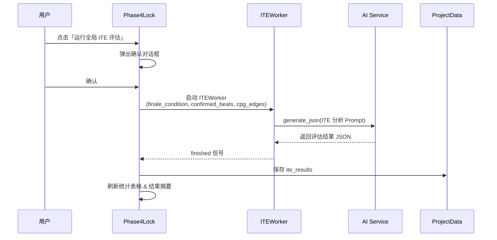

# 锁定阶段全局 ITE 剧本质量评估

## 背景

ITE（Individual Treatment Effect，个体处理效应）是系统中基于因果推断理论的剧本质量评估工具。它通过 AI 评估每个事件对终局达成的因果贡献度（τᵢ），识别冗余事件（水戏）并计算全局故事连贯度。

**现状问题**：ITE 目前仅在血肉阶段（Phase 3）作为"可选操作"存在，大多数情况下用户跳过，导致锁定阶段（Phase 4）的表格全部显示"未计算"。

**方案决策**：在锁定阶段（Phase 4）增加"一键全局 ITE 评估"按钮。这是最高效率、最低返工风险的时机——所有 Beat 已定稿但扩写正文尚未开始/已完成，发现问题可及时退回修改。

---

## Proposed Changes

### Phase 4 锁定界面

#### [MODIFY] [phase4_lock.py](file:///e:/project/0414/ui/phase4_lock.py)

**新增功能：**

1. **「📊 运行全局 ITE 评估」按钮**
   - 位置：放在按钮行中，`← 返回血肉阶段继续修改` 按钮的右侧
   - 样式：醒目的橙色按钮（与导出按钮的蓝/紫色区分）
   - 点击后：
     - 弹出确认对话框，提示将对全剧 N 个节点的所有事件进行因果评估
     - 确认后调用 `ITEWorker`，在后台线程执行 AI 分析
     - 运行期间按钮变为 `评估中…`，显示耗时计时器（复用扩写阶段的 elapsed 模式）
     - 完成后自动刷新统计表格中的 ITE 列和连贯度

2. **ITE 结果可视化增强**
   - 在统计表格下方增加一个 **结果摘要区域**，包含：
     - 🟢 全局连贯度百分比（绿/橙/红三色标记）
     - ⚠️ 结构性警告列表（如"阶段X和阶段Y之间缺少高冲击事件"）
     - 🗑️ 冗余事件数量及列表（ITE < 0.05 的事件）

3. **「取消评估」按钮**
   - 评估运行期间显示红色取消按钮，允许用户中断

**具体变更：**

```python
# 新增 import
from PySide6.QtCore import QTimer
from services.worker import ITEWorker

# __init__ 中新增：
self._ite_worker = None
self._ite_elapsed = 0
self._ite_timer = QTimer(self)  # 耗时计时器

# _setup_ui 中按钮行新增：
self._btn_ite = QPushButton("📊 运行全局 ITE 评估")  # 橙色醒目按钮
self._btn_cancel_ite = QPushButton("⏹ 取消评估")      # 评估中才可见
self._ite_elapsed_label = QLabel("")                    # 耗时标签

# ITE 结果展示区（表格下方）：
self._ite_summary_group = QGroupBox("📊 ITE 因果评估结果")
self._ite_coherence_label = QLabel("")     # 连贯度
self._ite_warnings_label = QLabel("")      # 结构性警告
self._ite_prunable_label = QLabel("")      # 冗余事件摘要

# 新增方法：
def _on_run_ite()          # 点击按钮 → 确认弹窗 → 启动 Worker
def _on_ite_done(result)   # Worker 完成 → 更新 ite_results → 刷新表格
def _on_ite_error(msg)     # Worker 失败 → 提示
def _on_cancel_ite()       # 取消按钮
def _on_ite_tick()         # 计时器每秒更新
def _set_ite_busy(busy)    # 按钮状态切换
```

---

### 数据流



---

## Open Questions

> [!IMPORTANT]
> **ITE 评估位于哪个阶段的 AI 设置面板？**
> 目前锁定阶段没有 AI 调用设置面板。ITE 的默认温度是 0.3（极低，保证严格逻辑分析）。有两个选择：
> 1. **直接使用默认参数**（推荐，简单，ITE 不需要创意性）
> 2. 在锁定阶段也加一个 AI 设置面板
>
> 计划采用方案 1，如有异议请告知。

---

## Verification Plan

### Automated Tests
- 启动应用，进入锁定阶段
- 确认按钮 `📊 运行全局 ITE 评估` 正常显示
- 点击后弹出确认框，确认后按钮变为 `评估中…`，显示耗时计时器
- AI 返回后：表格 ITE 列从"未计算"变为实际分数（带颜色标记）
- 下方摘要区显示连贯度、警告、冗余事件
- 点击取消可终止评估
- 保存项目后重新打开，ITE 数据持久化

### Manual Verification
- 请用户在完成一个完整项目后测试全局评估的准确性和实用性
