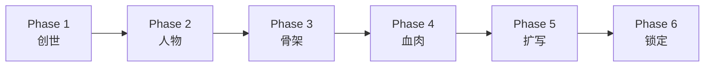
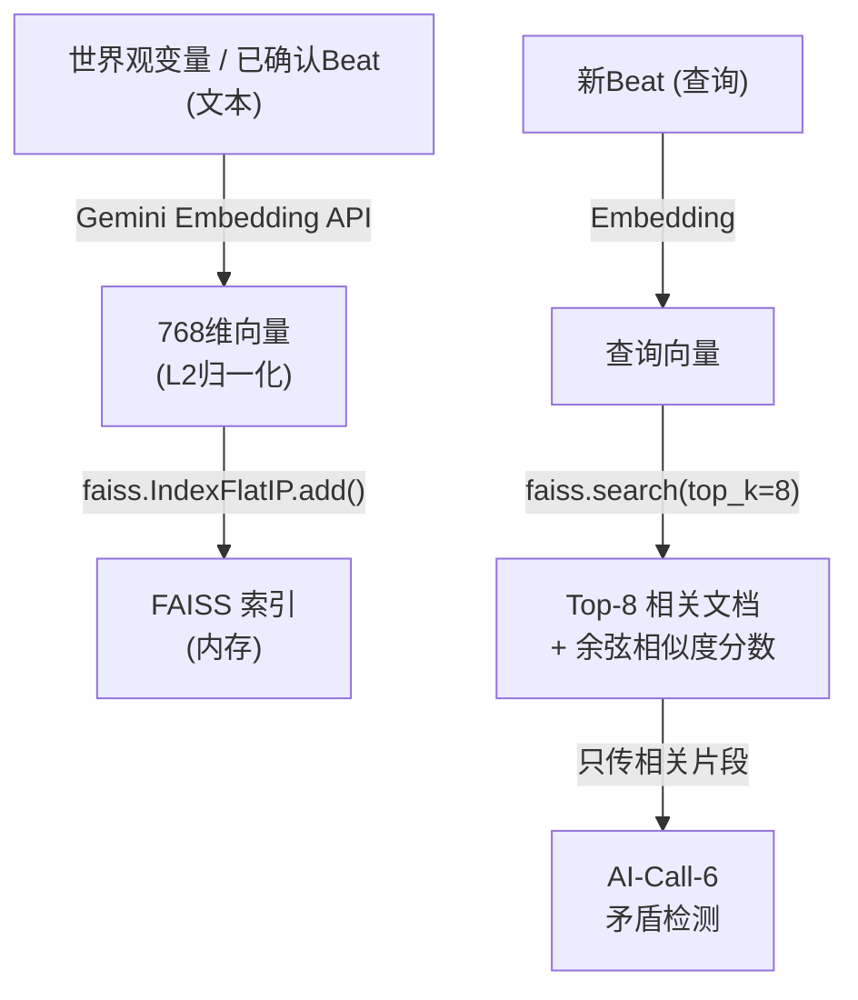

# NarrativeLoom V2 — 短剧剧本生成器 技术文档

> **版本**: V2  
> **代码规模**: 36 个 Python 文件，7,244 行代码  
> **技术栈**: PySide6 + Gemini 2.5 Flash (VertexAI) + FAISS  
> **项目路径**: `e:\project\0414\`

---

## 一、系统定位

**将一句话小说** → 经过6个阶段的人机协作 → **生成标准短剧剧本**（600-800字/节，含场景头、动作描写、角色对话）。

核心理论基础：
- **BVSR**（Blind Variation & Selective Retention）— 10个AI人格并行生成，人类选择保留最佳方案
- **CPG**（Causal Probability Graph）— Michael Hauge六阶段叙事骨架
- **ITE**（Individual Treatment Effect）— 因果蒸馏，评估每个事件的叙事必要性
- **RAG**（Retrieval-Augmented Generation）— FAISS 向量检索一致性审查

---

## 二、6 阶段流水线总览



| 阶段 | 名称 | AI 调用 | 输入 | 输出 |
|------|------|---------|------|------|
| Phase 1 | 创世 | AI-Call-1 苏格拉底盘问 + AI-Call-2 世界观提炼 | 一句话梗概 | 世界观变量表 + 终局条件 |
| Phase 2 | 人物 | AI-Call-1.5 角色建议（可选） | 世界观 | 角色阵容 + 人物关系 |
| Phase 3 | 骨架 | AI-Call-3 CPG骨架生成 | 世界观 + 角色 | Hauge六阶段 CPG 图 (6-15节点) |
| Phase 4 | 血肉 | AI-Call-4 盲视变异(×N人格) | CPG节点 + 角色 | 每个节点的 StoryBeat |
| Phase 5 | 扩写 | AI-Call-7 剧本扩写 | StoryBeat + 角色 | 600-800字/节 标准剧本 |
| Phase 6 | 锁定 | — | 全部数据 | CPG总览 + .story.json导出 + .txt剧本导出 |

**可选调用**（Phase 4 确认全部节点后触发）：
- AI-Call-5 ITE因果蒸馏
- AI-Call-6 RAG一致性审查（FAISS向量检索）

---

## 三、项目文件结构

```
e:\project\0414\
├── main.py                              # 程序入口（97行）
├── env.py                               # 8个AI Prompt定义 + 10个Persona（643行）
├── proxyserverconfig.py                 # 代理+VertexAI+QPS配置（26行）
├── requirements.txt                     # PySide6, google-genai, faiss-cpu
│
├── models/
│   ├── data_models.py                   # 数据结构: HaugeStage, CPGNode, Character等（241行）
│   └── project_state.py                 # ProjectData + .story.json序列化（130行）
│
├── services/
│   ├── ai_service.py                    # Gemini API封装 + Embedding生成（291行）
│   ├── persona_engine.py                # 10人格管理 + 变异调用参数构建（175行）
│   ├── ite_calculator.py                # ITE因果蒸馏封装（117行）
│   ├── rag_controller.py               # FAISS向量检索 + RAG审查【核心】（343行）
│   └── worker.py                        # 8个QThread Worker（449行）
│
├── ui/
│   ├── main_window.py                   # 6阶段导航主窗口（318行）
│   ├── phase1_genesis.py                # 创世界面（284行）
│   ├── phase2_characters.py             # 人物设定界面【V2新增】（353行）
│   ├── phase2_skeleton.py               # 骨架界面（289行）
│   ├── phase3_flesh.py                  # 血肉迭代界面（693行）
│   ├── phase5_expansion.py              # 剧本扩写界面【V2新增】（481行）
│   ├── phase4_lock.py                   # 锁定/导出界面（277行）
│   └── widgets/
│       ├── ai_settings_panel.py         # 温度/TopP/TopK/MaxTokens 控制
│       ├── beat_card.py                 # Beat变体卡片展示
│       ├── character_editor.py          # 角色详情编辑器【V2新增】
│       ├── character_relation_panel.py  # 人物关系管理【V2新增】
│       ├── cpg_graph_editor.py          # CPG可视化图（QGraphicsView）
│       ├── persona_selector.py          # 10人格多选面板
│       ├── prompt_viewer.py             # System Prompt 折叠展示
│       ├── qa_panel.py                  # 苏格拉底问答面板
│       ├── screenplay_editor.py         # 剧本编辑器+字数统计【V2新增】
│       └── world_var_table.py           # 世界观变量表
│
├── key/                                 # VertexAI 服务账号密钥
├── projects/                            # .story.json 项目文件保存目录
└── vector_db/                           # （保留目录，FAISS索引在内存中）
```

---

## 四、8 次 AI 调用详解

### AI-Call-1: 苏格拉底盘问
| 项目 | 值 |
|------|-----|
| **触发** | 用户输入一句话后点击"开始盘问" |
| **模型** | Gemini 2.5 Flash |
| **温度** | 0.4（低温，确保问题精准） |
| **System Prompt** | 6维度追问（时空规则/冲突根源/动机链/道具能力/终局标准/情感基调） |
| **输出格式** | JSON：5-8个问题，每个含 dimension + question + rationale |
| **数据流** | 一句话梗概 → AI → 问题列表 → 展示在QA面板 |

### AI-Call-2: 世界观变量提炼
| 项目 | 值 |
|------|-----|
| **触发** | 用户回答完全部追问后点击"锁定世界观" |
| **温度** | 0.2（极低温，提取事实不增添） |
| **输出** | JSON：story_title + finale_condition + variables[] + conflicts[] |
| **变量分类** | 世界规则 / 角色设定 / 道具能力 / 社会制度 / 终局条件 |

### AI-Call-1.5: 角色自动生成 【V2新增】
| 项目 | 值 |
|------|-----|
| **触发** | Phase 2 用户点击"AI建议角色"（可选，也可全手动） |
| **温度** | 0.5 |
| **输入** | 梗概 + 世界观变量 + 终局条件 |
| **输出** | JSON：characters[] + relations[] + design_notes |
| **角色字段** | name, role_type, gender, age, position, personality, motivation, appearance, notes |

### AI-Call-3: CPG 骨架生成
| 项目 | 值 |
|------|-----|
| **触发** | Phase 3 点击"生成CPG骨架" |
| **温度** | 0.6 |
| **输入** | 梗概 + 世界观 + 终局条件 + **角色阵容**（V2注入） |
| **输出** | JSON：cpg_title + hauge_stages[6阶段×1-3节点] + causal_edges[] |
| **规则** | Hauge六阶段严格顺序，每节点3-5事件摘要，不允许孤岛节点 |

### AI-Call-4: 盲视变异（BVSR核心）
| 项目 | 值 |
|------|-----|
| **触发** | Phase 4 选中节点 + 选择人格 → 点击"生成变体" |
| **温度** | 1.0-1.2（高温，最大化发散） |
| **并行** | 最多3并发，间隔1-5秒随机 |
| **人格数** | 用户选择1-10个人格（默认全选） |
| **输入** | 完整上下文 = 梗概 + 世界观 + CPG骨架 + 已确认Beat历史 + **角色信息** |
| **输出** | 每个人格独立生成一个 StoryBeat JSON（setting, entities, causal_events[], hook） |

### AI-Call-5: ITE 因果蒸馏（可选）
| 项目 | 值 |
|------|-----|
| **触发** | 全部Beat确认后，用户选择"运行ITE/RAG"时触发 |
| **温度** | 0.3 |
| **功能** | 评估每个事件的 ITE 分数（0-1），标记冗余事件 |
| **输出** | event_evaluations[] + structural_warnings[] + full_story_coherence |

### AI-Call-6: RAG 一致性审查（可选）
| 项目 | 值 |
|------|-----|
| **触发** | 跟随 ITE 之后自动执行 |
| **温度** | 0.1（极低温，严格检查） |
| **V2改进** | **不再全量dump**，而是 FAISS 检索 Top-8 相关片段后只传相关内容 |
| **输出** | pass_count + fail_count + conflicts[]（含severity/conflict_type/suggestion） |

### AI-Call-7: 剧本扩写 【V2新增】
| 项目 | 值 |
|------|-----|
| **触发** | Phase 5 点击"AI扩写当前节点"或"批量扩写全部" |
| **温度** | 0.7 |
| **输入** | Beat摘要 + 角色信息 + 前情hook + 目标字数 |
| **输出** | 标准短剧剧本正文（场景头 + 动作描写 + 角色对话） |
| **格式** | `场景 N  【INT/EXT. 地点 - 时间】` + `角色名（语气）："对话"` |
| **字数** | 可调：默认600-800字/节，支持300-5000范围 |

---

## 五、核心技术实现

### 5.1 FAISS 本地向量检索（RAG）

> [!IMPORTANT]
> **这是V2的核心改进**——从"全量dump给AI"升级为"本地余弦相似度检索 + 只送相关片段"。

**技术栈**：
- **Embedding**: Gemini `text-embedding-004` (768维，支持中文)
- **向量索引**: FAISS `IndexFlatIP`（内积索引）
- **相似度**: L2归一化后的内积 = 余弦相似度（本地计算，不消耗AI token）

**数据流**：



**关键代码**：[rag_controller.py](file:///e:/project/0414/services/rag_controller.py)

| 方法 | 功能 |
|------|------|
| `index_world_variables()` | 世界观变量 → Embedding → FAISS写入 |
| `index_beat()` | Beat → 文本化 → Embedding → FAISS写入 |
| `retrieve(query, top_k=8)` | 查询文本 → Embedding → FAISS余弦搜索 → 返回Top-K文档+分数 |
| `check_consistency()` | retrieve() → 只用Top-K片段组装Prompt → AI审查 |

**对比旧方案**：

| | V1 (全量) | V2 (FAISS) |
|---|---|---|
| 相似度计算 | ❌ 无 | ✅ 本地FAISS (余弦) |
| AI输入量 | 全量Beat JSON (随节点数增长) | 固定Top-8片段 |
| Token消耗 | O(n) 随节点线性增长 | O(1) 恒定 |
| 精确度 | AI自行判断相关性 | 向量语义检索预筛选 |

---

### 5.2 盲视变异 BVSR（10人格系统）

**10个人格**分4类（定义在 [env.py](file:///e:/project/0414/env.py) 中）：

| 类别 | 人格 | 创作风格 |
|------|------|---------|
| **启动型** | 历史考据者、科幻未来主义者、民俗神秘学者 | 设定与世界观构建 |
| **推进型** | 法庭辩论者、间谍大师、心理分析师 | 冲突推进与逆转 |
| **氛围型** | 诗人导演、都市传说写手 | 环境与情感渲染 |
| **终结型** | 悲剧建筑师、救赎叙事者 | 结局与代价设计 |

**执行机制**（[worker.py](file:///e:/project/0414/services/worker.py) `VariationWorker`）：
1. 用户选择 K 个人格（默认全选10个）
2. 每个人格独立生成一个 StoryBeat（System Prompt 拼入人格身份块）
3. 最多3并发，每次间隔1-5秒随机（QPS控制）
4. 生成完毕后展示 K 张卡片，用户选择最佳方案
5. 选择后可在JSON编辑器中手动微调，再确认

---

### 5.3 人物系统 【V2新增】

**数据结构**（[data_models.py](file:///e:/project/0414/models/data_models.py)）：

```python
Character:
  char_id, name, role_type(主角|反派|辅助|配角|群演),
  gender, age, position, personality, motivation,
  appearance, notes

CharacterRelation:
  from_char_id, to_char_id, relation_type, description
```

**角色信息注入点**：
- AI-Call-3 (骨架): `{characters_summary}` → 节点的characters字段使用真实姓名
- AI-Call-4 (变异): 角色概要注入 → Beat中使用角色实名
- AI-Call-7 (扩写): 角色信息 + 性格 → 对话反映角色个性

---

### 5.4 ITE 因果蒸馏

**原理**：评估"如果删除事件X，整体因果链是否断裂"。

- ITE分数 0-1：越高越不可删除
- 自动标记：关键(>0.7) / 重要(0.3-0.7) / 普通(0.1-0.3) / 冗余(<0.1)
- 用户可一键剔除冗余事件

---

### 5.5 项目持久化

**文件格式**: `.story.json`

```json
{
  "version": "1.0",
  "current_phase": "expansion",
  "sparkle": "一句话梗概",
  "qa_pairs": [...],
  "world_variables": [...],
  "characters": [...],
  "character_relations": [...],
  "cpg_nodes": [...],
  "cpg_edges": [...],
  "confirmed_beats": {"N1": {...}, "N2": {...}},
  "screenplay_texts": {"N1": "剧本正文...", "N2": "..."},
  "generation_history": [...]
}
```

**自动保存时机**: 每次阶段切换自动保存（如已有文件路径）。

---

## 六、完整操作流程

### Phase 1: 创世

1. 输入一句话梗概（如："一个流亡皇子发现母亲留下的芯片装置，踏上了推翻暴政之路。"）
2. 点击 **"开始盘问"** → AI生成5-8个追问
3. 逐个回答追问（可查看"追问依据"理解为什么问这个）
4. 全部回答后点击 **"锁定世界观"** → AI提炼变量表
5. 在右侧变量表中可手动增删改
6. 点击 **"确认→进入人物设定"**

### Phase 2: 人物 【V2新增】

1. 可选：点击 **"🤖 AI建议角色"** → AI根据梗概+世界观生成3-8个角色
2. 手动：点击 **"＋ 添加角色"** → 填写姓名/类型/性格/动机等
3. 左侧列表选中角色 → 右侧编辑详情
4. 下方 **"＋ 添加关系"** → 设定角色间关系（如"父子/敌对"）
5. 点击 **"确认人物设定，进入骨架→"**

### Phase 3: 骨架

1. 点击 **"生成CPG骨架"** → AI基于Hauge六阶段生成6-15个节点的因果图
2. 上方：CPG可视化图（可拖拽节点）
3. 下方：节点详情（事件摘要列表），可手动编辑
4. 不满意可 **"重新生成"** 或 **手动添加/删除节点**
5. 确认后点击 **"进入血肉→"**

### Phase 4: 血肉（迭代核心）

1. 下拉选择节点（自动定位第一个未确认节点）
2. 选择参与的人格（默认全选10个）
3. 点击 **"开始生成变体"** → N个人格并行生成
4. 左侧出现N张卡片 → 点击选择最佳方案
5. 右侧JSON编辑器可微调细节
6. 点击 **"确认此Beat→"** → 自动跳到下一节点
7. 全部确认后弹出选择：运行ITE/RAG（可选） 或 直接进入扩写

### Phase 5: 扩写 【V2新增】

1. 左侧：Beat摘要（只读参考） + 角色性格参考
2. 右侧：剧本文本编辑器（带实时字数统计）
3. 可设置目标字数范围（默认600-800字/节）
4. 点击 **"🔄 重新扩写当前节点"** → 单节点扩写
5. 或点击 **"🚀 批量扩写全部节点"** → 依次自动扩写
6. 扩写结果可直接在编辑器中修改
7. 点击 **"📄 导出全部剧本"** → 保存为.txt文件
8. 确认后 **"完成扩写，进入锁定→"**

### Phase 6: 锁定

1. 上方：完成的CPG因果图（只读）
2. 下方：统计摘要（总节点数/总事件数/Hauge阶段覆盖）
3. **"导出为 .story.json"** → 工程文件，可后续重新打开编辑

---

## 七、运行环境与配置

### 依赖安装

```bash
pip install PySide6 google-genai google-auth faiss-cpu
```

### 关键配置（proxyserverconfig.py）

| 配置项 | 当前值 | 说明 |
|--------|--------|------|
| PROXY_URL | `http://127.0.0.1:7897` | 本地代理（访问VertexAI） |
| VERTEX_PROJECT_ID | `gen-lang-client-0682241933` | GCP项目ID |
| VERTEX_MODEL | `gemini-2.5-flash` | 生成模型 |
| MAX_CONCURRENT_CALLS | 3 | 盲视变异最大并发 |
| MIN_CALL_INTERVAL | 1秒 | 调用最短间隔 |
| MAX_CALL_INTERVAL | 5秒 | 调用最长间隔 |

### 启动

```bash
cd e:\project\0414
.venv\Scripts\python.exe main.py
```

---

## 八、已知限制

| # | 问题 | 状态 | 说明 |
|---|------|------|------|
| 1 | FAISS索引不持久化 | ⚠️ 已知 | 每次启动需重新索引，但由于Beat确认时自动索引，实际影响不大 |
| 2 | Embedding API消耗 | ⚠️ 轻微 | 每次索引/检索需调用Gemini Embedding API（text-embedding-004），费用极低 |
| 3 | 扩写阶段场景拆分 | 📋 待定 | 当前每个CPG节点扩写为1个场景，未实现自动拆分为多场景 |
| 4 | 剧本导出格式 | 📋 待定 | 目前仅支持.txt，未实现.docx/.pdf/Fountain格式 |
| 5 | Phase 1→2 信号传递 | ✅ 已修复 | phase_completed(dict) 正确连接 |
| 6 | QSplitter类型错误 | ✅ 已修复 | `0x01` → `Qt.Vertical` |
| 7 | AI空响应崩溃 | ✅ 已修复 | NoneType防御 |

---

## 九、审计通过状态

最近一次全量审计（10项）：**10/10 全部通过** ✅

| # | 审计项 | 结果 |
|---|--------|------|
| 1 | data_models — Character + CharacterRelation | ✅ |
| 2 | project_state — 新字段序列化往返 | ✅ |
| 3 | env.py — 新Prompt + 占位符完整性 | ✅ |
| 4 | worker — 新Worker + 角色注入 | ✅ |
| 5 | proxyserverconfig — 间隔1-5s | ✅ |
| 6 | widgets — 3个新组件实例化 | ✅ |
| 7 | phases — 6个Phase + MainWindow | ✅ |
| 8 | Phase2Characters — on_enter | ✅ |
| 9 | Phase5Expansion — on_enter | ✅ |
| 10 | 数据流 — Phase2→3→5 | ✅ |
